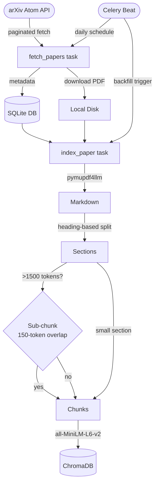
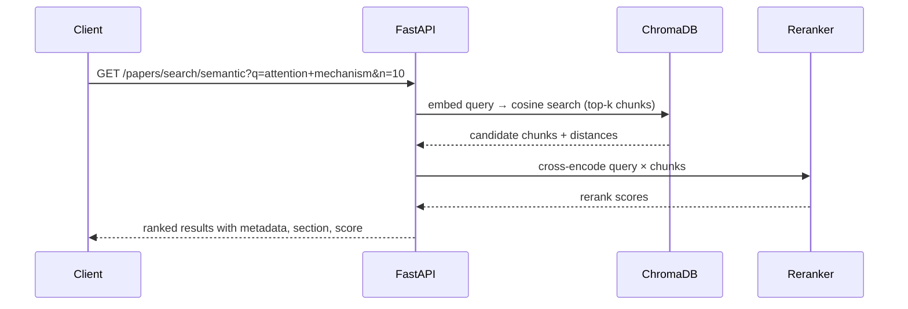
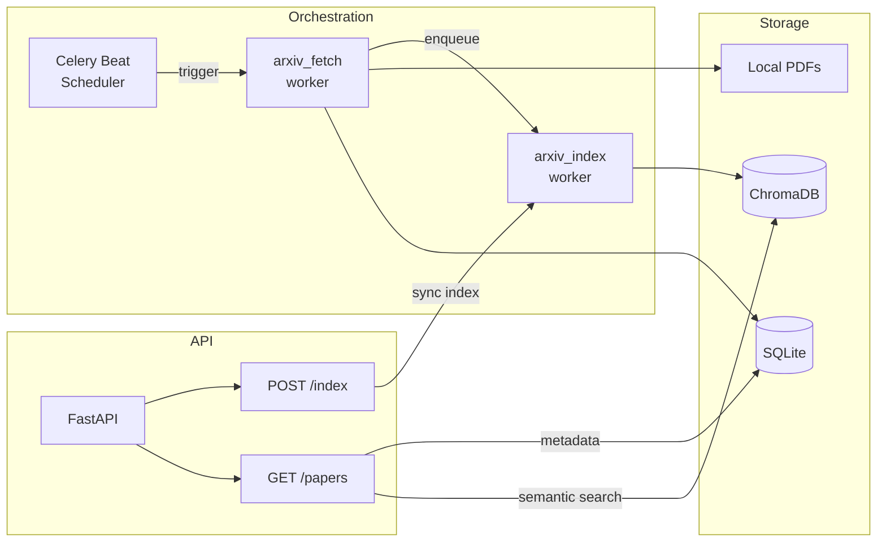

# arXiv RAG Agent

A production-grade pipeline that ingests arXiv papers daily, indexes them into a vector store, and exposes a semantic search API — built to make a growing corpus of research papers queryable in seconds.

---

## What It Does

1. **Fetches** papers from the arXiv API across configurable categories (cs.AI, cs.LG, cs.CL, etc.) on a daily schedule
2. **Stores** full PDFs and metadata in a local SQLite database
3. **Indexes** each paper by converting PDFs → Markdown → section-aware chunks → ChromaDB embeddings
4. **Serves** a FastAPI layer for listing, retrieving, and semantically searching the corpus

---

## Semantic Search Demo

Query: *"How does the attention mechanism work in transformers?"*

```json
[
  {
    "paper_id": "arxiv:2601.00919",
    "title": "Attention Needs to Focus: A Unified Perspective on Attention Allocation",
    "section": "ABSTRACT",
    "rerank_score": 7.07,
    "text": "The Transformer architecture's core innovation — the self-attention mechanism — achieves success
             by computing pairwise similarity scores between queries and keys. Empirical evidence shows
             that standard attention often deviates from ideal behavior, giving rise to two widely
             observed phenomena: representational collapse and attention sink..."
  },
  {
    "paper_id": "arxiv:2601.00923",
    "title": "Context Collapse: In-Context Learning and Model Collapse",
    "section": "1.1.4 The attention mechanism",
    "rerank_score": 7.33,
    "text": "By computing content-based weights over the entire input sequence, attention enables the model
             to access any position directly (at constant distance). It supports highly parallel matrix
             operations, thereby addressing the representational and computational limitations of
             recurrent architectures..."
  },
  {
    "paper_id": "arxiv:2601.00426",
    "title": "RMAAT: Astrocyte-Inspired Memory Compression and Replay for Efficient Long-Context Transformers",
    "section": "ABSTRACT",
    "rerank_score": 5.27,
    "text": "The quadratic complexity of self-attention presents a significant impediment to applying
             Transformer models to long sequences. RMAAT employs a recurrent, segment-based processing
             strategy with persistent memory tokens and an adaptive compression mechanism inspired by
             astrocyte long-term plasticity..."
  }
]
```

Results include chunk-level context, section metadata, cosine distance, and rerank scores — ready for downstream LLM summarization.

---

## Tech Stack

| Layer | Technology |
|---|---|
| Orchestration | Celery + Celery Beat |
| Broker | Redis |
| Database | SQLite (swappable to Postgres) |
| API | FastAPI + Uvicorn |
| Vector Store | ChromaDB (HTTP server mode) |
| Embeddings | `sentence-transformers/all-MiniLM-L6-v2` |
| PDF Parsing | `pymupdf4llm` (PDF → Markdown) |
| Agent Framework | LangGraph / LangChain (WIP) |

---

## Architecture

### Ingestion & Indexing Pipeline



### Query Flow



### Component Overview



---

## Directory Structure

```
src/
  config.py              # Pydantic-settings; all paths & env vars
  categories.py          # ArxivCategory enum (cs.AI, cs.LG, …)
  celery_app.py          # Celery app, Beat schedule, queue routing
  arxiv_client.py        # Atom API client with pagination
  tasks/
    fetch_papers.py      # Ingestion Celery tasks
    index_papers.py      # Embedding + ChromaDB upsert tasks
  storage/
    local_storage.py     # PDF download & filesystem layout
    db_client.py         # SQLite client (singleton, swappable)
  indexing/
    pdf_parser.py        # PDF → markdown + section chunking
    vector_store.py      # ChromaDB wrapper (singleton)
  api/
    app.py               # FastAPI entry point
    routers/
      papers.py          # GET /papers/, /papers/{id}, /papers/search/semantic
      indexing.py        # POST /index/paper/{id}, /index/reindex
scripts/
  fetch_on_demand.py     # Run a single-category fetch without a broker
  fetch_all_on_demand.py # Run all-category fetch without a broker
  inspect_vectordb.py    # Tabulate ChromaDB contents in the terminal
```

---

## Quick Start

### Prerequisites

- Python 3.10+
- Redis (for Celery broker)
- ChromaDB server running locally

```bash
git clone https://github.com/sankalpshekhar14/research-paper-agent
cd research-paper-agent
python -m venv venv && source venv/bin/activate
pip install -r requirements.txt
cp .env.example .env   # then edit paths
```

### Configuration (`.env`)

```bash
CELERY_BROKER_URL=redis://localhost:6379/0
CELERY_RESULT_BACKEND=redis://localhost:6379/0
PAPERS_STORAGE_PATH=/your/data/path/papers
SQLITE_DB_PATH=/your/data/path/papers.db
ARXIV_MAX_RESULTS_PER_QUERY=100
ARXIV_RATE_LIMIT_SECONDS=3.0
CHROMA_HOST=localhost
CHROMA_PORT=8000
```

### Fetch papers (no broker required)

```bash
# Single category
python scripts/fetch_on_demand.py cs.AI --date 2024-01-15

# All categories
python scripts/fetch_all_on_demand.py --date 2024-01-15

# Verbose
python scripts/fetch_on_demand.py cs.AI --date 2024-01-15 -v
```

### Production pipeline (Celery)

```bash
# Terminal 1 — broker
redis-server

# Terminal 2 — fetch worker (concurrency=1 respects arXiv rate limits)
celery -A src.celery_app worker -Q arxiv_fetch --concurrency=1 --loglevel=info

# Terminal 3 — scheduler
celery -A src.celery_app beat --loglevel=info
```

### Index papers & run the API

```bash
# Index a single paper
python -c "from src.tasks.index_papers import index_paper; index_paper.run('arxiv:2401.12345')"

# Backfill all stored papers
python -c "from src.tasks.index_papers import reindex_all_papers; reindex_all_papers.run()"

# Start the API
uvicorn src.api.app:app --reload --port 8080
# Swagger UI → http://localhost:8080/docs
```

---

## API Reference

| Method | Path | Description |
|--------|------|-------------|
| GET | `/health` | Health check |
| GET | `/papers/` | List papers (`limit`, `offset`, `category`) |
| GET | `/papers/{paper_id}` | Full metadata for one paper |
| GET | `/papers/search/semantic?q=...&n=5` | Semantic search over indexed chunks |
| POST | `/index/paper/{paper_id}` | Index a single paper synchronously |
| POST | `/index/reindex` | Backfill all un-indexed papers |
| GET | `/index/status/{paper_id}` | Check if a paper is indexed |
| DELETE | `/index/paper/{paper_id}` | Remove all chunks for a paper |

---

## Chunking & Indexing Details

- PDFs are parsed to Markdown via `pymupdf4llm`
- Split on headings (`#` / `##` / `###`) into sections
- Sections over **1500 tokens** are sub-chunked with **150-token overlap**
- Each chunk stores: `paper_id`, `title`, `categories`, `published_date`, `section`
- Chunk ID format: `arxiv:2401.12345::chunk::0`
- ChromaDB collection: `papers`, distance: cosine

---

## Roadmap

- [ ] LangGraph conversational agent over the indexed corpus
- [ ] Postgres support (db_client is interface-swappable)
- [ ] Test suite
- [ ] Docker Compose setup for one-command start

---

## Adding a Category

1. Add a member to `ArxivCategory` in `src/categories.py`
2. Done — the scheduler and scripts iterate the enum automatically

## Common Issues

| Issue | Fix |
|---|---|
| Empty results for a date | Some dates have 0 submissions in narrow categories — try a wider category or different date |
| arXiv 500 errors | Caused by `+` signs inside `submittedDate` brackets — use literal spaces instead |
| Rate limited | Run `arxiv_fetch` workers with `--concurrency=1` |
